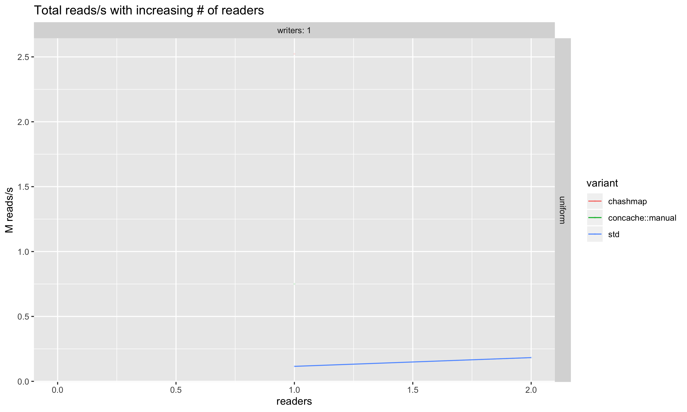
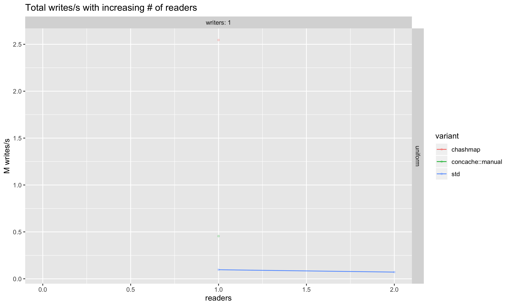

# concache

This crate provides two implementations of fast, concurrent, shared hash maps.

Both implementations provide lock-free implementations that use [lock-free linked list
buckets](https://www.microsoft.com/en-us/research/wp-content/uploads/2001/10/2001-disc.pdf).
Memory is safely destructed and reclaimed using either
[`crossbeam::epoch`](https://docs.rs/crossbeam-epoch/) or a manual _Quiescent-State-Based
Reclamation_ implementation. See the [`crossbeam`] and [`manual`] module documentations
respectively for further details.

Table resizing is not yet supported in either implementation, but the map will also never fill
due to the linked implementation; instead, performance will decrease as the map is filled with
more keys.

The crate was written by Aditya Saligrama and Andrew Shen while writing _A practical analysis
of Rust’s concurrency story_ as their 2018 project for [MIT
PRIMES](https://math.mit.edu/research/highschool/primes/program.php).

## Performance

We've run some benchmarks of concache against a standard Rust `HashMap`
protected by a [reader-writer
lock](https://doc.rust-lang.org/std/sync/struct.RwLock.html), as well as
against [chashmap](https://crates.io/crates/chashmap) — a crate which provides
"concurrent hash maps, based on bucket-level multi-reader locks". The
benchmarks were run using the binary in [benchmark/](benchmark/src/main.rs) on
a 40-core machine with Intel(R) Xeon(R) CPU E5-2660 v3 @ 2.60GHz CPUs.

The benchmark runs a number of reader and writer threads in tight loops, each
of which does a read or write to a random key in the map respectively. Results
for both uniform and skewed distributions are provided below. The benchmark
measures the average number of reads and writes per second as the number of
readers and writers increases.

Preliminary results show that `concache` performs well under contention.

